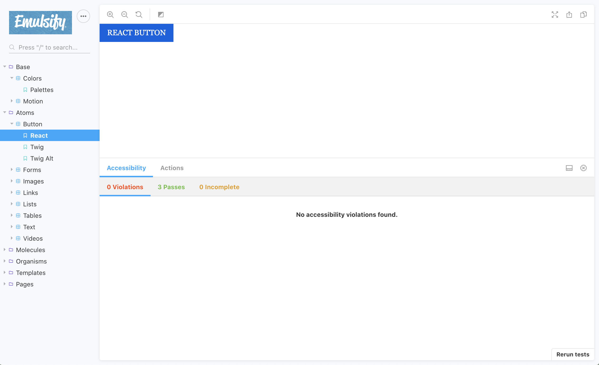

# Accessibility Testing

Emulsify Drupal has multiple ways of testing accessibility.

### Storybook a11y Addon

Emulsify Drupal uses Storybook's [a11y addon](https://github.com/storybookjs/storybook/tree/master/addons/a11y), and it is the default panel open in Storybook's addons pane. This makes it easy to verify the components you build are accessible in the UI. 

### Accessibility Tests \(CLI\)

The Storybook panel pane is excellent for passive testing, but if you want to utilize more active tests \(that will fail on CI builds or not allow commits\), then you can use the CLI tool. This can be used in the following ways:

1. Command: `yarn a11y` or `npm run a11y` 
2. As a part of tests: `yarn test` or `npm run test` 
3. Coverage report: `yarn coverage` 

The CLI tool is flexible and can be configured to meet your project needs. Edit the [a11y.config.js](https://github.com/emulsify-ds/emulsify-drupal/blob/develop/a11y.config.js) file to set the level of severity you want to see, codes to be ignored, the runner to use and what components you would like to test.

